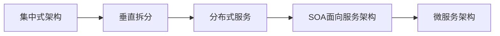

# SpringCloudLeaning
A Learning Project For The SpringCloud
 - 使用RestTemplate发送请求
 - 说出SpringCloud的作用
 - 搭建Euraka注册中心
 - 使用Robbin负载均衡
 - 使用Hystrix熔断

### sc-hoxton-chapter1
使用RestTemplate发送请求

    - HttpClient
    - OkHttp
    - JDK原生URLConnetction

